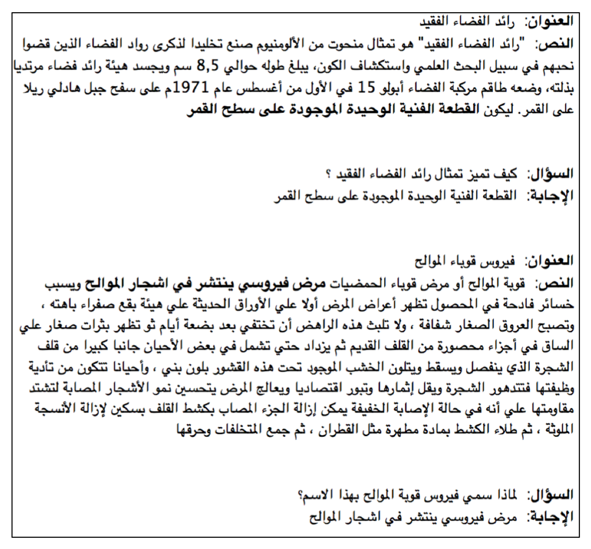

# Arabic WikiReading and KaifLematha Datasets
This repository contains Arabic reading comprehension datasets Arabic WikiReading (factoid dataset) and KaifLematha (non-factoid dataset)

 |               | train | development| test | validated dev.| validated test | total |
 | ------------- |:---:| :---: | :---: | :---: | :---: | :---: |
 | Arabic WikiReading  | 79,048  | 9806  | 9789  | 9485  | 7379  | 98,643 |
 | KaifLematha  | 5563  | 619  | 579  | 619 |579  | 6761  |
## Arabic WikiReading Dataset 

### Arabic WikiReading dataset collection
The Arabic WikiReading dataset was constructed in four steps: Wikipedia paragraph curation, query–answer pair collection from the Wikidata knowledge base, consolidation of the query–answer pairs to the Wikipedia paragraphs, and construction of the validated develop- ment and test sets. The dataset was automatically constructed under a distant supervision strategy, adopting Wikidata as a source for query-answer pairs and Wikipedia for Arabic articles. Arabic articles were collected from [arwikiExtracts](https://github.com/motazsaad/arwikiExtracts), which contains documents’ extracts that were collected by parsing the Arabic _20190920_ version of Wikipedia dump.

We extracted an Arabic Wikidata dump (sized 10.5G) from the _20190909.JSON_ dump. For each statement we extracted the item label, property and the value to form (item, property, answer) triple, where the answer represents the value of this property given the item. To construct the Arabic WikiReading dataset, we replaced each Wikidata item in the (item, property, answer) triples with the appropriate Wikipedia curated paragraph, knowing the title of the Wikipedia article that matches the item in the collected triples, and discarding any item not linked to Wikipedia articles. 

Training the model on a large distant supervised dataset is effective under time and budget constraints, but evaluation should be done on manually annotated development and test sets. For this purpose, we constructed validated development and test sets by human annotation of the original development and test sets. Given a query–answer pair and its respective paragraph, each annotator was expected to read the paragraph, the query and the answer, then judge whether the answer “follows,” “likely follows,” or “does not follow” from the text.
### Dataset format
The format for Arabic WikiReading follow
```
file.json
├── "data"
│   └── [i]
│                ├── “title”: “document title”
│                ├── "context": "paragraph text"
│                └── "qas"
│                   └── [k]
│                      ├── "answers"
│                      │   └── [l]
│                      │       ├── "answer_start": N
│                      │       └── "text": "answer"
│                      ├── "id": "<uuid>"
│                      └── "question": "paragraph question?"
└── "version": 1.1
```
## KaifLematha Dataset

### KaifLematha dataset collection
Crowdsourcing was employed to collect non-factoid Arabic questions and answers. The crowdsourcing was performed in two phases: question–answer pair collection from the curated Wikipedia paragraphs, and the collection of additional answers by annotators for the development and test sets. Presented with an interface containing a paragraph, each annotator was asked (if possible) to construct two why questions and two how questions in their own words.

To make the evaluation process more robust and to get an indication about human performance, we employed a new group of eight annotators in the second phase. These annotators were instructed to collect two additional answers to each question in the development and test sets. They were asked to read the question and the paragraph and highlight the shortest span containing the answer.
### Dataset foramt 
The format for KaifLematha follow
```
file.json
├── "data"
│   └── [i]
│                ├── “title”: “document title”
│                ├── "context": "paragraph text"
│                └── "qas"
│                   └── [k]
│                      ├── "answers"
│                      │   └── [l]
│                      │       ├── "answer_start": N
│                      │       └── "text": "answer"
│                      ├── "id": "<uuid>"
│                      └── "question": "paragraph question?"
└── "version": 1.1
```
